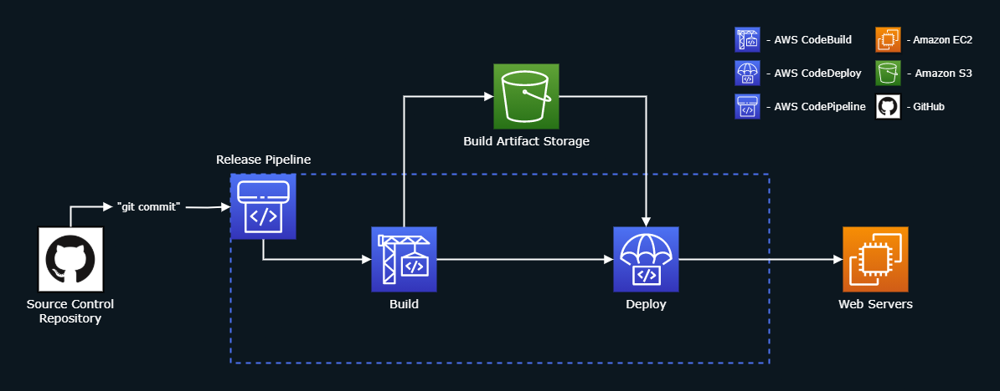

# [Byte-Size.Links](https://bytesize.link/)

## Overview
Converts any URL to a short "byte-link", which can easily be used and shared. Below are some examples:
- https://bytesize.link/cron - Online Cron Formatter
- https://bytesize.link/devops - DevOps Periodic Table
- https://bytesize.link/pytorch - Medium Article on Lyft & PyTorch

Website: https://bytesize.link

# Architecture Diagram

## Notes
- The web servers auto-scale to handle fluctuating traffic
- The servers are behind a load balancer to evenly distribute web traffic, preventing any one from becoming overwhelmed
- **GenerateURL** uses [TensorFlow's Toxicity Classifier Model](https://medium.com/tensorflow/text-classification-using-tensorflow-js-an-example-of-detecting-offensive-language-in-browser-e2b94e3565ce) to filter out inappropriate custom links
  - The link to the [source repository is here](https://github.com/tensorflow/tfjs-models/tree/master/toxicity)
  - This library had to be included as a [Lambda Layer](https://docs.aws.amazon.com/lambda/latest/dg/configuration-layers.html) to work with AWS Lambda

# Code Release Diagram

## Notes
- [CodePipeline](https://aws.amazon.com/codepipeline/) is automatically triggered whenever it detects a change in this GitHub repository:
- 1. The code is compiled with [CodeBuild](https://aws.amazon.com/codebuild/), and unit tests are executed against it.
- 2. Once the code is built, and the unit tests pass, the build artifacts are stored in an [S3 bucket](https://aws.amazon.com/s3/).
- 3. [CodeDeploy](https://aws.amazon.com/codedeploy/) uses the stored artifacts and deploys the updated app into the web servers
- CodeDeploy uses a [Blue/Green Deployment](https://martinfowler.com/bliki/BlueGreenDeployment.html), using two live environments: 
  - **Blue:** Uses the existing code
  - **Green:** Uses the new code
  - After validating that the green environment works properly, I can choose to remove the blue environment
  - If the green environment has issues, I can quickly switch back to the blue environment
