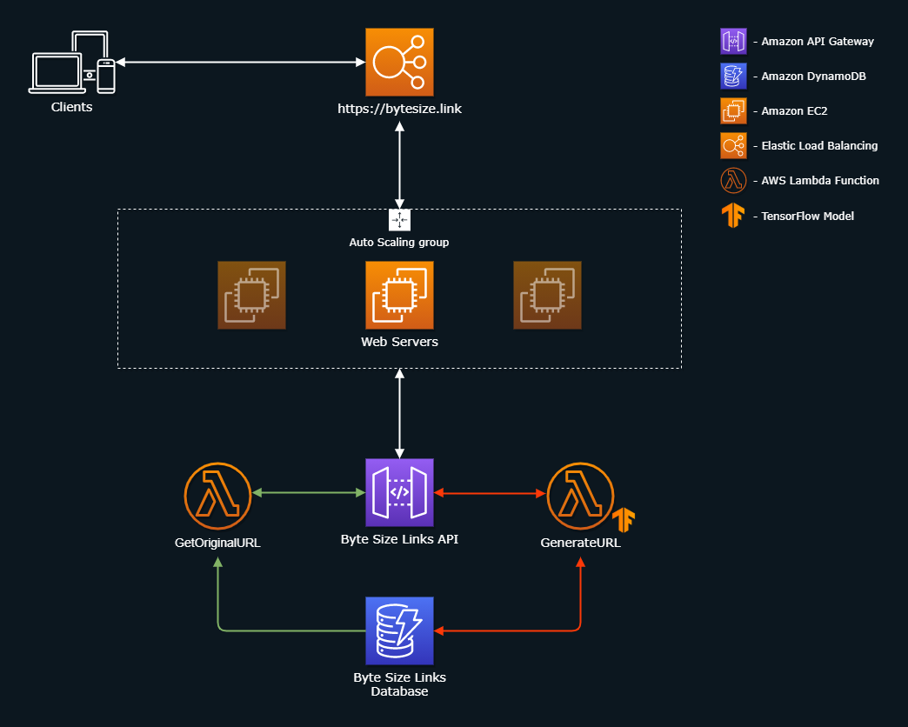

# [Byte-Size.Links](https://bytesize.link/)

## Overview
Converts any URL to a short "byte-link", which can easily be used and shared. Below are some examples:
- https://bytesize.link/3sytdp8w - AWS Elastic Load Balancing Landing Page
- https://bytesize.link/alzob8a9 - Alexa Automotive Skills Best Practices
- https://bytesize.link/boamivrv - Medium Article on PyTorch powering Lyft's Self-Driving Cars

Website: https://bytesize.link

# Architecture Diagram

## Notes
- Deployment of the app to the web servers is handled with AWS CodePipeline*, CodeBuild*, and CodeDeploy* directly from this repository using [continuous delivery](https://aws.amazon.com/devops/continuous-delivery/)
  - \* - Not included in Architecture Diagram
