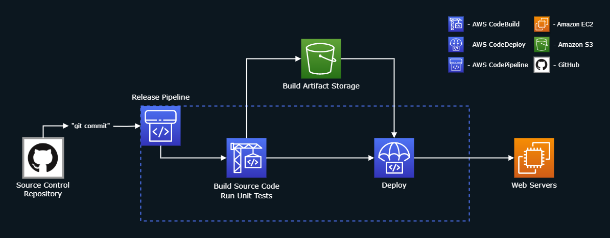

# [Byte-Size.Links](https://bytesize.link/)

## Overview
Converts any URL to a short "byte-link", which can easily be used and shared. Below are some examples:
- https://bytesize.link/3sytdp8w - AWS Elastic Load Balancing Landing Page
- https://bytesize.link/alzob8a9 - Alexa Automotive Skills Best Practices
- https://bytesize.link/boamivrv - Medium Article on PyTorch powering Lyft's Self-Driving Cars

Website: https://bytesize.link

# Architecture Diagram

## Notes
- The web servers auto-scale to handle fluctuating traffic
- The servers are behind a load balancer to evenly distribute web traffic, preventing any one from becoming overwhelmed

# Code Release Diagram

## Notes
- CodePipeline is automatically triggered whenever it detects a change in this GitHub repository
- CodeBuild saves the build artifacts in storage, which is then used by CodeDeploy to update the web servers
- CodeDeploy uses a [Blue/Green Deployment](https://martinfowler.com/bliki/BlueGreenDeployment.html), using two live environments: 
  - **Blue:** Uses the existing code
  - **Green:** Uses the new code
  - After validating that the green environment works properly, I can choose to remove the blue environment
  - If the green environment has issues, I can quickly switch back to the blue environment
